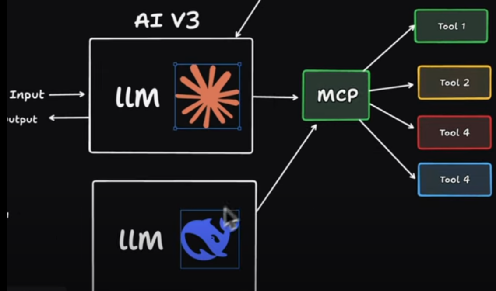

# Model Context Protool

- courtesy : Jan Marshal (Youtube)

- LLM uses different tools/services (like DuckDuckGo) to get real time data
- you can have multiple tools
- you have wrappers using which the LLM interacts with the tools
- but when you have thousands of tools used by different LLMs, and if a tool updates it's api, you wiall also have to update the related wrappers(for each LLM)

### we want this to be more manageable and scalable
- we need a layer in the middle which can translate all of the mess for us and create a standardized process
### Enter MCP 🦸
 
- Model : referes to our LLM like Claude, GPT, Deepseek etc
- Context : everything
- Protocol : Connector connects MCP client to the server

### its an open protocol that standardizes how apps provide context to LLMs

- the mcp server is provided by the tool/service you want to use

